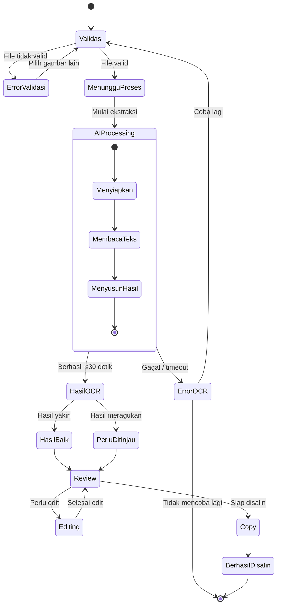

Siap. Kita susun **DRAFT User Flow** ini dengan mengacu pada struktur requirement CitraTeks Web yang tadi sudah kita bedah. Fokusnya adalah **dua fitur utama**: **★ Ekstraksi Teks Otomatis** dan **Peninjauan & Penyalinan Hasil OCR**.

# DRAFT USER FLOW — CITRATEKS WEB

## 1. Tujuan User Flow

User flow ini menggambarkan perjalanan **Budi**, mahasiswa tingkat akhir dan penulis lepas, ketika mengunggah foto dokumen fisik untuk:

1. Memproses gambar menggunakan AI OCR secara otomatis.
2. Melihat dan meninjau hasil ekstraksi teks.
3. Mengedit bagian yang kurang tepat.
4. Menyalin hasil OCR ke laporan.

Alur dirancang dengan asumsi bahwa **AI tidak selalu berhasil** dan proses OCR dapat membutuhkan waktu hingga **30 detik per citra**.

---

# 2. Alur Utama Pengguna

### Titik masuk

Budi membuka **CitraTeks Web** dan berada pada halaman utama.

### Langkah 1 — Memilih gambar

Budi memilih tombol **"Unggah Gambar"** kemudian memilih foto dokumen dari perangkat.

Sistem menampilkan pratinjau gambar yang dipilih.

### Langkah 2 — Validasi awal di perangkat

Sebelum gambar dikirim ke server, sistem melakukan validasi:

* Apakah file merupakan format gambar yang didukung?
* Apakah file dapat dibaca?
* Apakah ukuran file masih dalam batas yang ditentukan?
* Apakah gambar tidak kosong/rusak?

**Jika valid:** pengguna dapat melanjutkan.

**Jika tidak valid:** sistem menampilkan pesan kesalahan dan meminta Budi memilih gambar lain.

> Validasi dilakukan sebelum pengiriman agar kesalahan sederhana dapat diketahui pengguna tanpa harus menunggu proses AI.

---

# 3. Fitur AI ★ — Ekstraksi Teks Otomatis

Setelah gambar lolos validasi, Budi menekan tombol **"Mulai Ekstraksi"**.

### Status 1 — Validasi

```text
Gambar dipilih
      ↓
Validasi format & file
      ↓
Valid?
 ┌────┴────┐
Tidak      Ya
 ↓          ↓
Error    Kirim gambar
           ke sistem
```

### Status 2 — AI sedang memproses

Sistem mulai melakukan pemrosesan gambar dan OCR.

Pada tahap ini, jangan hanya menampilkan halaman kosong atau spinner tanpa informasi.

Sistem menampilkan:

> **"Sedang menganalisis gambar..."**

Disertai:

* indikator loading/progress,
* status proses,
* informasi bahwa proses dapat membutuhkan waktu hingga **30 detik**,
* opsi untuk membatalkan proses apabila memungkinkan.

Contoh transisi:

```text
0–5 detik
"Menyiapkan gambar..."

5–15 detik
"AI sedang membaca teks..."

15–25 detik
"Menyusun hasil teks..."

25–30 detik
"Hampir selesai..."
```

Progress tersebut sebaiknya dianggap sebagai **indikator tahap**, bukan persentase akurasi atau progres AI yang sebenarnya.

### Batas waktu

Sistem harus memberikan hasil atau pesan kegagalan maksimal **≤30 detik sejak gambar diunggah**.

---

# 4. Status 3 — Penanganan Hasil OCR

Setelah AI selesai, terdapat dua kondisi utama.

### A. Hasil yakin/baik

Jika hasil OCR memenuhi kriteria kualitas yang ditentukan:

```text
AI selesai
   ↓
Hasil OCR tersedia
   ↓
Tingkat keyakinan baik
   ↓
Tampilkan hasil
```

Budi dapat:

* membaca hasil OCR,
* menyalin seluruh teks,
* mengedit teks jika diperlukan.

Sistem tetap dapat memberikan pengingat ringan:

> "Periksa kembali hasil sebelum digunakan."

Hal ini penting karena **hasil OCR bukan jaminan 100% benar**.

---

### B. Hasil meragukan

Jika sistem mendeteksi bagian yang kemungkinan memiliki kesalahan:

```text
AI selesai
   ↓
Hasil OCR tersedia
   ↓
Ada bagian meragukan
   ↓
Tandai bagian tersebut
   ↓
Budi meninjau/mengedit
```

Contohnya, teks yang kurang yakin dapat diberikan penanda visual seperti:

> `Sistem informa[si] digital`

Bagian tertentu dapat diberi highlight atau indikator **"Perlu ditinjau"**.

Sistem menampilkan pesan:

> **"Beberapa bagian hasil OCR mungkin kurang akurat. Silakan tinjau sebelum menyalin."**

Ini menghubungkan **US-06 (Menyunting hasil)** dan **US-07 (Indikasi perlu ditinjau)**.

---

# 5. Fitur Utama — Peninjauan dan Penyalinan Hasil OCR

Setelah hasil OCR ditampilkan, Budi masuk ke tahap **Review**.

### Langkah 1 — Melihat hasil

Budi membaca teks yang telah diekstraksi.

### Langkah 2 — Meninjau hasil

Budi memeriksa:

* kata,
* angka,
* tanda baca,
* susunan paragraf,
* bagian yang diberi tanda perlu ditinjau.

### Langkah 3 — Mengedit

Jika terdapat kesalahan, Budi mengubah teks secara langsung melalui editor.

Contoh:

```text
HASIL OCR

Implementasi sistem
informasi digitai
        ↑
   perlu diperiksa
```

Budi mengubah:

```text
digitai
```

menjadi:

```text
digital
```

### Langkah 4 — Menyalin hasil

Setelah yakin dengan hasilnya, Budi menekan:

**"Salin Teks"**

Sistem menyalin teks yang **sudah ditinjau/diedit**, bukan sekadar hasil mentah OCR.

Sistem memberikan feedback:

> **"Teks berhasil disalin."**

Budi kemudian dapat menempelkannya ke laporan atau dokumen lain.

---

# 6. Status 4 — Fallback / AI Gagal

AI tidak boleh diasumsikan selalu berhasil.

Ada beberapa kemungkinan kegagalan:

### A. Citra tidak terbaca

Misalnya:

* terlalu buram,
* terlalu gelap,
* teks terlalu kecil,
* gambar rusak.

Sistem menampilkan:

> **"Teks pada gambar tidak dapat dikenali dengan baik."**

Kemudian memberikan tindakan:

**"Unggah Gambar Lain"**

atau

**"Coba Lagi"**

---

### B. AI gagal merespons

Jika proses OCR mengalami error atau melewati batas waktu:

```text
Proses OCR
    ↓
Gagal / timeout
    ↓
Tampilkan pesan error
    ↓
Coba lagi?
 ┌────┴────┐
Ya        Tidak
 ↓          ↓
Upload     Selesai
ulang
```

Pesan harus bersifat informatif, tetapi tidak terlalu teknis.

**Kurang baik:**

> `HTTP 500 — OCR inference exception`

**Lebih ramah pengguna:**

> **"Maaf, proses ekstraksi teks gagal. Silakan coba lagi dengan gambar yang lebih jelas."**

---

# 7. Mermaid — Diagram User Flow

Berikut diagram yang bisa langsung dimasukkan ke dokumentasi Markdown/GitHub:

```mermaid
flowchart TD

    A([Mulai]) --> B[Halaman Utama CitraTeks Web]
    B --> C[Klik "Unggah Gambar"]
    C --> D[Pilih Gambar Dokumen]
    D --> E[Pratinjau Gambar]

    E --> F{Validasi di Perangkat}

    F -->|Format/ukuran tidak valid| G[Tampilkan Pesan Error]
    G --> H[Pilih Gambar Lain]
    H --> D

    F -->|Valid| I[Klik "Mulai Ekstraksi"]
    I --> J[Kirim Gambar ke Sistem]

    J --> K[Status: AI Sedang Menganalisis]
    K --> K1[Indikator Proses]
    K1 --> K2["Menyiapkan → Membaca Teks → Menyusun Hasil"]
    K2 --> L{OCR Berhasil ≤30 detik?}

    L -->|Tidak| M[Tampilkan Pesan Kegagalan]
    M --> N{Coba Lagi?}

    N -->|Ya| D
    N -->|Tidak| Z([Selesai])

    L -->|Ya| O[Tampilkan Hasil OCR]

    O --> P{Hasil Meragukan?}

    P -->|Ya| Q[Tandai Bagian yang Perlu Ditinjau]
    Q --> R[Pengguna Meninjau Hasil]

    P -->|Tidak| R

    R --> S{Perlu Mengedit?}

    S -->|Ya| T[Edit Hasil OCR]
    T --> U[Periksa Kembali Hasil]

    S -->|Tidak| U

    U --> V[Klik "Salin Teks"]
    V --> W[Teks Disalin ke Clipboard]
    W --> X[Tampilkan Konfirmasi "Teks Berhasil Disalin"]
    X --> Z([Selesai])
```

---

# 8. State Diagram Sistem

Selain flowchart, **state diagram** juga cocok untuk menunjukkan empat status sistem yang diminta:



---

# 9. Tabel Kaitan User Flow dengan User Story

| No. | Tahap User Flow          | User Story           | Status      | Keterangan                                               |
| --- | ------------------------ | -------------------- | ----------- | -------------------------------------------------------- |
| 1   | Memilih gambar           | **US-01**            | Must Have   | Pengguna mengunggah citra dokumen                        |
| 2   | Validasi file            | **US-01**            | Must Have   | Sistem memeriksa kelayakan file sebelum dikirim          |
| 3   | Pemrosesan RGB/grayscale | **US-02**            | Must Have   | Sistem memproses citra yang diunggah                     |
| 4   | AI menganalisis gambar   | **US-03 ★**          | Must Have   | Sistem melakukan ekstraksi teks otomatis menggunakan OCR |
| 5   | Indikator proses         | **US-03 ★**          | Must Have   | Pengguna mendapat feedback selama proses AI              |
| 6   | Batas ≤30 detik          | **NFR Respon Waktu** | NFR         | Hasil atau kegagalan harus ditampilkan maksimal 30 detik |
| 7   | Menampilkan hasil        | **US-04**            | Must Have   | Hasil OCR ditampilkan kepada pengguna                    |
| 8   | Menandai hasil meragukan | **US-07**            | Should Have | Bagian yang perlu ditinjau diberi indikasi               |
| 9   | Meninjau hasil           | **US-06**            | Should Have | Pengguna memeriksa hasil OCR                             |
| 10  | Mengedit teks            | **US-06**            | Should Have | Pengguna dapat memperbaiki hasil OCR                     |
| 11  | Menyalin teks            | **US-05**            | Must Have   | Pengguna menyalin hasil OCR                              |
| 12  | OCR gagal                | **US-08**            | Must Have   | Sistem memberikan pesan kegagalan                        |
| 13  | Coba lagi                | **US-08**            | Must Have   | Pengguna dapat melakukan fallback dengan gambar lain     |
| 14  | Selesai                  | **US-05**            | Must Have   | Teks sudah berhasil disalin                              |

---

# 10. Ringkasan Empat Status Sistem

| Status                  | Kondisi                         | Respons Sistem                               | Aksi Pengguna                           |
| ----------------------- | ------------------------------- | -------------------------------------------- | --------------------------------------- |
| 🟡 **Validasi Awal**    | Gambar baru dipilih             | Periksa format, ukuran, dan keterbacaan file | Memperbaiki/mengganti gambar            |
| 🔵 **AI Processing**    | OCR sedang berjalan             | Tampilkan indikator proses dan status tahap  | Menunggu atau membatalkan jika tersedia |
| 🟢 **Penanganan Hasil** | OCR selesai                     | Tampilkan teks; tandai bagian meragukan      | Membaca, meninjau, mengedit, menyalin   |
| 🔴 **Fallback**         | OCR gagal/tidak terbaca/timeout | Tampilkan pesan error yang mudah dipahami    | Coba lagi dengan gambar lain            |

---

## 11. Prinsip UX yang Digunakan

Beberapa keputusan UX penting dalam flow ini:

**1. Validasi dilakukan sedini mungkin**
Kesalahan format/ukuran file tidak perlu dikirim ke server sehingga pengguna tidak membuang waktu menunggu.

**2. AI selalu memberikan feedback selama proses**
Karena OCR dapat membutuhkan waktu sampai 30 detik, pengguna harus tahu bahwa sistem masih bekerja.

**3. Progress tidak dibuat palsu**
Sistem tidak sebaiknya menampilkan "OCR 73%" apabila tidak benar-benar mengetahui persentase proses. Lebih aman menggunakan status seperti *"AI sedang membaca teks"*.

**4. Hasil OCR dianggap sebagai draft**
Bahkan hasil dengan tingkat keyakinan baik tetap perlu ditinjau sebelum digunakan dalam laporan.

**5. Kesalahan AI dibuat terlihat tetapi tidak mengganggu**
Bagian meragukan diberi indikasi sehingga Budi tahu bagian mana yang perlu diperiksa.

**6. Fallback selalu tersedia**
Ketika AI gagal, pengguna tidak dibuat buntu. Ia mendapat penjelasan dan tindakan berikutnya.

**7. Feedback setelah menyalin**
Setelah tombol **"Salin Teks"** ditekan, sistem memberikan konfirmasi agar Budi tahu bahwa tindakan berhasil.

---

### Kesimpulan

Secara keseluruhan, flow CitraTeks Web dapat diringkas menjadi:

**Unggah → Validasi → Proses AI ★ → Hasil OCR → Deteksi hasil meragukan → Review/Edit → Salin → Selesai**

dengan dua jalur alternatif:

**Validasi gagal → Upload ulang**

dan

**OCR gagal/timeout → Error → Coba lagi/Upload ulang**

Dengan struktur ini, **US-01 sampai US-08 dan NFR ≤30 detik semuanya punya posisi yang jelas dalam user flow**, sehingga draft ini juga enak dipakai sebagai dasar untuk tugas berikutnya seperti **wireframe, interaction design, atau usability testing**.
